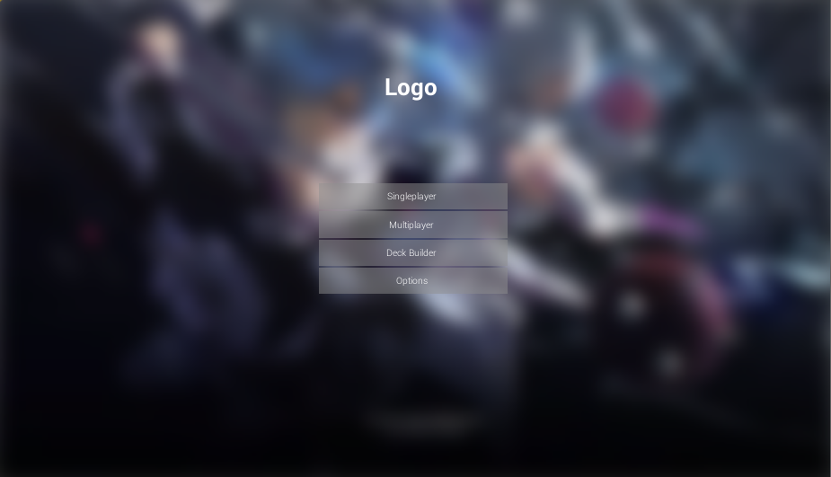

# ACG Card Game
An experimental ACG card game, developed using Unreal Engine 4 (4.18.2)

# Preview

# Development Require
1. Download [Ue4 Launcher](https://www.unrealengine.com/download), Then install  latest version of Unreal Engine in Launcher.
